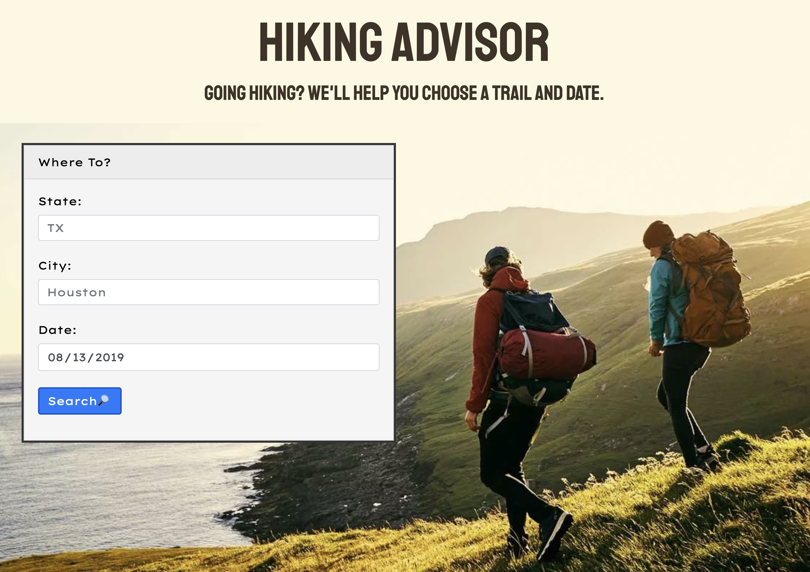

# [Hiking Advisor](https://danninemx.github.io/hiking-advisor/)

## Overview

This web application helps hikers choose a trail and date based on the user's destination and weather conditions.

It takes in the user's preferences and provides weather forecasts and relevant details about local trails.

---

## How to Use

1. Enter destination city & date on landing page.

   (Search is worldwide and State is optional -- but it can improve search accuracy.)

2. Check out weather conditions by time of day, and browse through trails in the area.

3. Click on a trail to learn more.

4. Don't forget to bring a towel! And a sunscreen.

---

## Components

- [Google Maps API](https://cloud.google.com/maps-platform/)
- [Open Weather API](https://rapidapi.com/community/api/open-weather-map)
- [Trail API](https://rapidapi.com/trailapi/api/trailapi)
- [jQuery](https://jquery.com)
- [Animate.css](https://github.com/daneden/animate.css/)
- [MomentJS](https://momentjs.com)

---

## Developers

- [Danny Kim](https://github.com/danninemx) (Team Leader)
- [Jose Hernandez](https://github.com/Unlovingmotherboard)
- [Joshua Munoz](https://github.com/Joshmunoz63)
